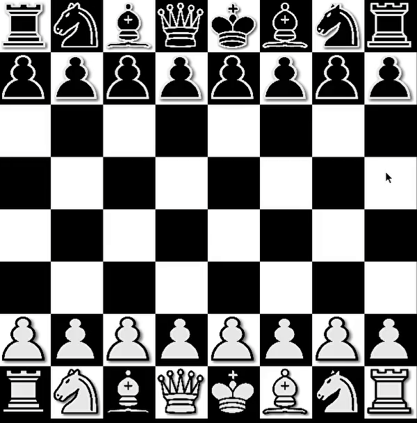
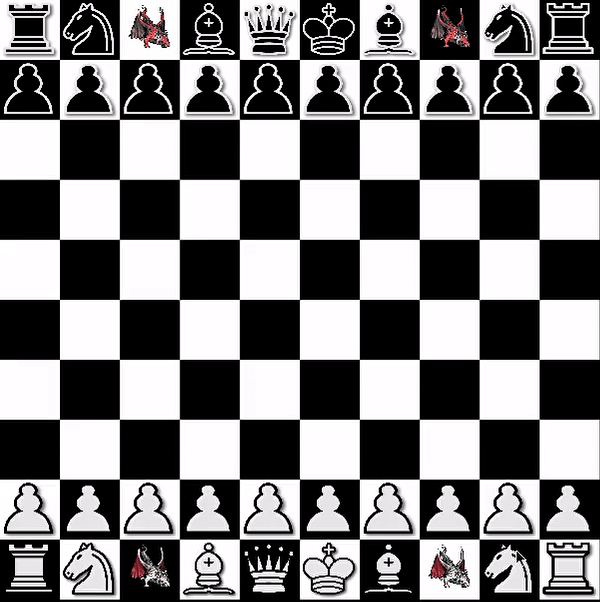

# Chess
In this repository we are going to create a Chess Engine on our own.

Using _pygame_ library we recreate the chess game, programming all the rules of each pieces, from easy moves to checks, castling and en passant.

There are still some issues that need to be solved.

Overall, the game look something like this:

Everytime a game is played, a pdf file is added, where, from LaTeX, the entire match is written there, in order to be analysed as if reading it on a book.

## ToDo: 
The idea is to implement an algorithm that understands chess and can play it on its own. Some AI program like the alphabeta prouning or something more sophisticated.

# Chess 2.0
Introducing __Chess 2.0__: I believe that everyone once in his life has imagined to add a piece to the chess board.

Now this dream is finally true! The __DRAGON__ is the new incredible, and definitely to fix (it is too strong), piece added.

Basically, it combines the moves of both the Bishop and the Knight.

Believe if I tell you that it is stronger than the Queen.

The game will be playable on a 10x10 board and it will be released a program, in order to avoid to install python and the other dependencies
 